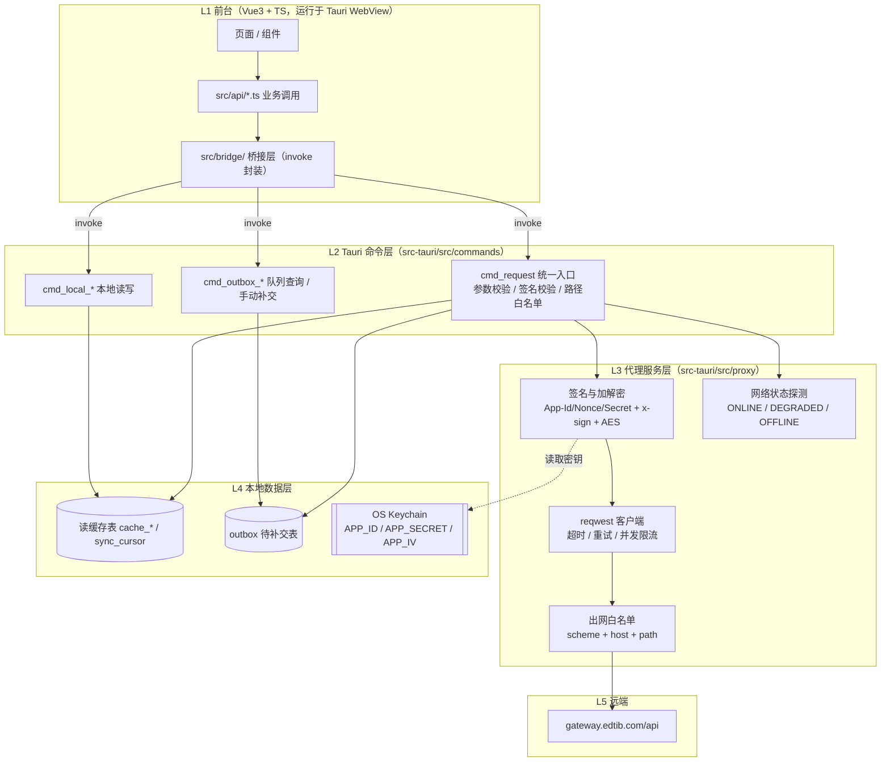
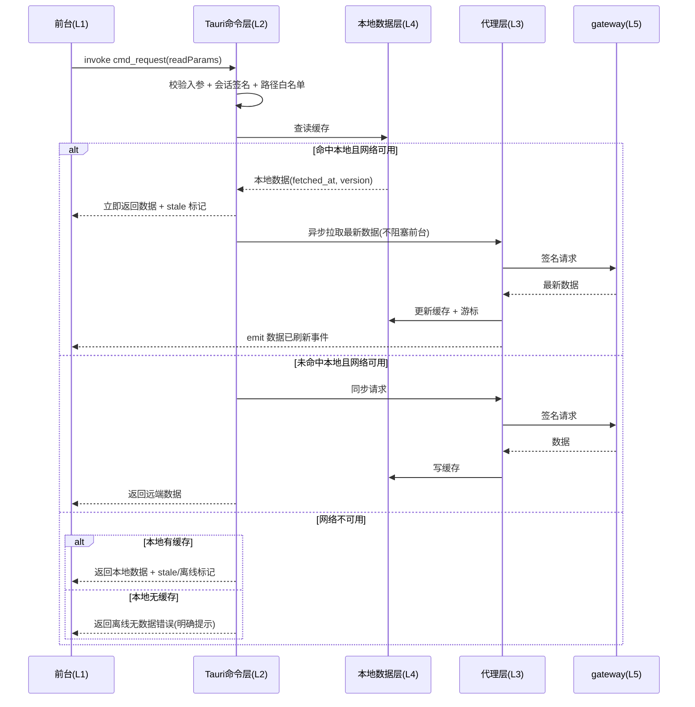
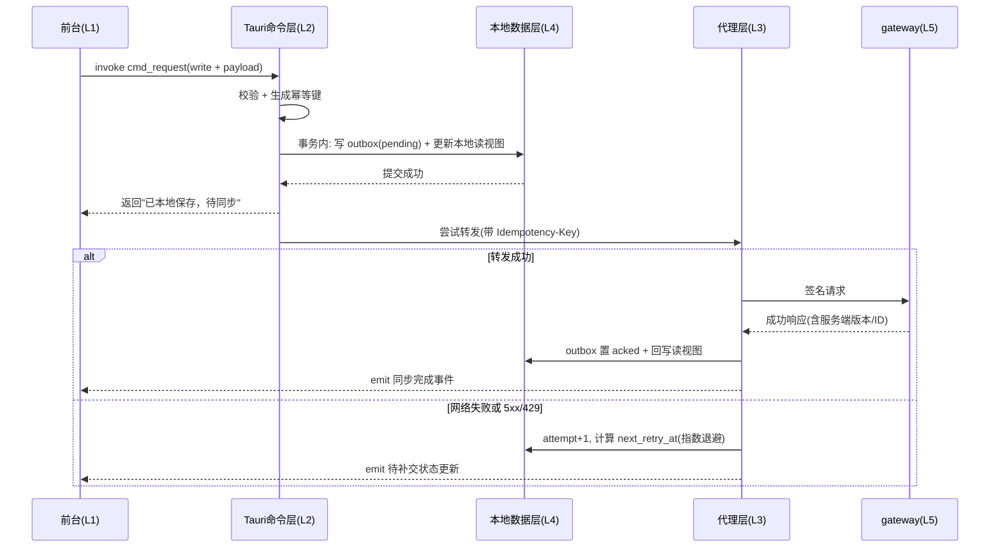
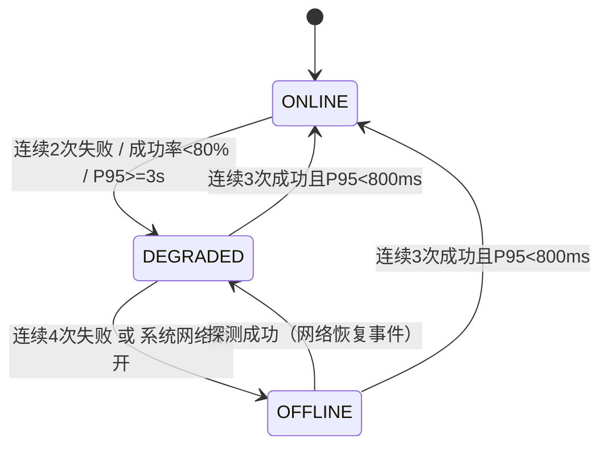
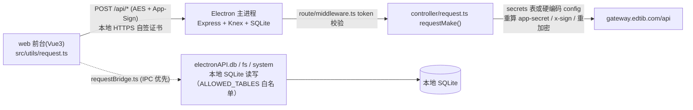

# EDTIB控制中台 · 半离线与代理架构设计（Tauri v2）

> 目的：为 console（Tauri v2）建立「前台只调 Tauri 本地接口 → Tauri 代理服务请求服务器 → 本地兜底与 outbox 补交」的半离线/弱网数据链路，取代老项目「本地 Express 端口 + 前端硬编码密钥」的形态。
>
> 范围：本文档仅为设计，不含实现代码；对老项目 `client/console` 的审计全程只读，未修改任何文件。
>
> 状态：**设计阶段**。第 6 章 10 项分叉项拍板后方可进入实施分期。
>
> 关联文档：[`electron-to-tauri.md`](./electron-to-tauri.md)、[`tauri-development.md`](./tauri-development.md)

---

## 1 方案概述与链路分层

### 1.1 设计目标

本方案为 EDTIB控制中台（Tauri v2，产品标识 `com.edtib.console`）定义前台数据的半离线链路：**前台只调用 Tauri 本地接口，由 Tauri 侧代理服务出网请求**；Tauri 校验通过后先取本地数据兜底，再用服务端密钥请求 gateway；服务端请求失败时以本地数据返回或写入本地待补交队列（outbox），网络恢复后重新提交。

量化基线如下（均为**设计目标，待实测校准**；老项目与本项目均未提供实测基准，故无对照值）：

| 维度 | 设计目标 | 验收方式 |
|---|---|---|
| 前端密钥硬编码 | 0 处（构建产物中不含 APP_SECRET / IV 明文或可还原密文） | 对 `dist/` 全量检索密钥特征串与变量名 |
| 本地监听端口 | 0 个（沿用 `docs/electron-to-tauri.md` 既有决策） | 端口扫描 + `tauri.conf.json` 审查 |
| 纯本地读 P95 | ≤ 50 ms（单表单万行内、命中本地数据） | 前端埋点统计 |
| 含一次成功转发的请求 P95 | ≤ 800 ms | 前端埋点统计 |
| 断网读可用率 | 本地已有数据时 ≥ 95% 请求可返回（附数据新鲜度标记） | 断网演练抽样 100 次 |
| 断网写不丢失 | 100%（进程被强杀或断电后重启，outbox 记录仍存在） | `kill -9` 后重启核查 |
| 恢复后补交 | 队列内可重试条目 100% 被尝试；单条成功率（排除业务拒绝）≥ 99% | 演练 + 日志统计 |
| 弱网状态抖动 | ≤ 1 次 / 10 分钟（依赖滞回阈值） | 弱网模拟（丢包 20% / 延迟 300 ms） |

### 1.2 链路分层

链路分五层，层间边界即安全边界：



各层职责与禁止事项：

| 层 | 职责 | 明确不做 |
|---|---|---|
| L1 前台 | 渲染交互、调用 `src/bridge/` 封装的命令、展示数据新鲜度与待补交状态 | 不持有业务密钥、不拼 URL、不直连 gateway、不做签名/加解密 |
| L2 命令层 | 入参结构与类型校验、会话签名校验、本地读写与 outbox 编排、错误码归一 | 不含业务规则以外的数据加工、不直接持有 reqwest 客户端 |
| L3 代理层 | 出网白名单校验、签名与加解密、超时/重试/限流、网络状态判定 | 不接受前台传入的完整 URL、不跟随跳转至白名单外主机 |
| L4 本地数据层 | 读缓存、outbox、同步游标、冲突副本；密钥托管 | 不存明文密钥、不缓存超出授权范围的敏感数据 |
| L5 远端 | gateway 业务接口 | 网关侧签名校验口径不变（见 2.7） |

> **边界原则**：L1 与 L2 之间**只有 Tauri IPC（`invoke`）**，不存在 HTTP 端口；真实出网流量只能出现在 L2 之下且必须经 L3 白名单。

### 1.3 两条主数据流

**读路径**（本地优先 + 后台刷新）：



**写路径**（先落库、后转发）：



### 1.4 关键设计决策一览

| 决策点 | 结论 | 理由 |
|---|---|---|
| 前台与 Tauri 的通信形态 | 纯 IPC（`invoke`），不启本地 HTTP 端口 | 沿用既有决策；消除本机任意进程可访问的代理端口（老项目本地端口即此风险） |
| 密钥归属 | 业务密钥仅存 OS Keychain，仅 Rust 侧可读 | 前端硬编码密钥随构建产物分发，等于公开（老项目现状，见 5.2） |
| 读请求策略 | 本地优先 + stale-while-revalidate | 弱网下响应稳定，且能通过事件回填最新数据 |
| 写请求策略 | 先写本地 outbox，再尝试转发 | 保证"已提交"语义不因网络中断丢失 |
| 出网控制 | scheme + host + path 三重白名单 | 前台不掌握 URL，代理层不接受任意目标 |
| 重试位置 | 代理层负责网络重试；写操作重试由 outbox 承担 | 避免"网络层自动重试写请求"导致重复提交 |
| 幂等 | 每条写请求携带幂等键，服务端需支持去重 | 重试与恢复补交的前提（服务端能力待确认，见 6.1 D6） |

### 1.5 与既有决策 / 现有文件的冲突（实施前必须解决）

| 编号 | 冲突点 | 事实依据 | 处理建议 |
|---|---|---|---|
| C1 | 本地数据库定位 | `docs/electron-to-tauri.md` 2.4 与 `src-tauri/src/state.rs` 注释明确"SQLite 仅保留能力，不作为本地业务数据缓存"；本方案的读缓存与 outbox 均需落库 | 修订 2.4 与代码注释，将定位改为"本地业务数据缓存仅限读缓存 + outbox，不承担业务写入的数据源角色"，见 6.1 D1 |
| C2 | 新仓库已存在明文业务密钥 | `console/.env.development` 含 `VITE_APP_ID/VITE_APP_SECRET/VITE_APP_IV/VITE_APP_BASE_URL/VITE_REQUEST_ENCRYPT` 等明文字段（与老项目 `client/console/web/.env.development` 同值） | 实施期删除这些字段并清理 git 历史中的明文值；本轮不修改文件 |
| C3 | 默认兜底密钥 | 老项目 `electron/src/config/cryptTool.ts` 内置 `defaultKey`（secret/iv）作为兜底 | 新方案禁止任何默认密钥；密钥缺失时必须显式失败并要求激活，禁止"降级到内置密钥" |

> 说明：C2 的密钥字段目前未被新项目任何前端代码引用（新 `console/src` 仅有 `App.vue`、`main.ts`），风险为"已提交入库的凭据"，而非"正在使用"。

### 1.6 本轮范围

本文档为设计文档，仅新增本文件；**不修改任何 Rust/Vue 代码**，对老项目 `client/console` 全程只读。第 6 章分叉项达成一致后方可进入实施分期。

## 2 密钥与鉴权方案

### 2.1 威胁模型与老项目风险对照

老项目（`client/console`）的密钥与本地服务形态存在四类可验证风险，本方案逐条给出对策：

| 风险 | 老项目证据 | 新方案对策 |
|---|---|---|
| 前端硬编码业务密钥 | `web/.env.development`、`web/.env.production` 明文 `VITE_APP_SECRET` / `VITE_APP_IV`；`web/src/utils/request.ts` 直接以 `import.meta.env.VITE_APP_SECRET` 做签名与 AES 加密 → 密钥随 JS 产物分发 | 前台零业务密钥；签名与加密全部下沉到 Rust 侧（2.2、2.6） |
| 主进程硬编码密钥 | `electron/src/config/index.ts` `cryptSecrets()` 在 `development` / `production` 两组中硬编码 `app_id` / `app_secret` / `app_iv` / `app_url` | 迁入 OS Keychain；仓库内不再出现任何业务密钥字面量（1.5 C3） |
| 内置兜底密钥 | `electron/src/config/cryptTool.ts` 定义 `defaultKey = { secret, iv }` 并被导出 | 删除兜底逻辑；密钥缺失即失败，禁止静默降级 |
| 本地代理端口无来源校验 + 关闭 TLS 校验 | `main.ts:70` 执行 `app.commandLine.appendSwitch('ignore-certificate-errors')`；本地 Express + 自签证书服务（老项目端口 64580）对任意本机进程开放 | 取消本地 HTTP 服务，改纯 IPC；出网强制校验证书、禁止 `accept_invalid_certs` |
| 本地文件读写无路径约束 | `electron` 的 fs IPC 以 `path.join(userDataPath, filePath)` 形式拼接传入路径 | 以 appData 为根做规范化 + 前缀校验，拒绝 `..`、绝对路径与符号链接逃逸（2.5） |

### 2.2 密钥分层与存放

| 密钥 | 用途 | 存放位置 | 生命周期 | 是否可离开本机 |
|---|---|---|---|---|
| K0 服务端 APP_SECRET（含 `app_id` / `app_iv` / `app_url`） | 代理层向 gateway 签名、加解密请求体 | OS Keychain，`service = com.edtib.console`，`account = app_secret / app_iv / app_id / app_url` | 首次激活写入；租户或密钥轮换时覆盖 | 否。仅 Rust 内存使用，禁止写日志、禁止回传前台 |
| K1 会话密钥 | 前台向 Tauri 命令层证明"请求来自本应用前台"，用于请求签名与防重放 | 安装时生成 32 字节随机值，存 Keychain（`account = ipc_session_key`） | 安装期生成，重装或显式重置时更新 | 否（见 6.1 D2：是否注入前台待拍板） |
| K2 前台携带的加密 APP_SECRET（用户口径） | 前台按需求"携带加密 APP_SECRET"访问 Tauri 接口 | 构建期预置密文或激活期下发密文，明文仅在 Rust 侧解密 | 随 K0 轮换 | 密文可存在于安装包（见 6.1 D4 的推荐纠偏） |

> **推荐纠偏（D4）**：前台携带的 `encrypted APP_SECRET` 其解密能力仍在同一进程内，攻击者可内存转储获取，安全增益有限。推荐前台**不持有任何 secret**（仅 K1 会话签名），由 Rust 用 Keychain 中的 K0 直接向 gateway 签名。若坚持用户口径，则必须满足：密文不可在无 Keychain 的情况下解密（密钥经 Keychain 派生），且密文每次激活轮换。

### 2.3 Keychain 落地

- 选型：Rust `keyring` crate（macOS 走 Security.framework / Keychain，Windows 走 Credential Manager，Linux 走 Secret Service），避免自行落盘加密。
- 首次激活流程：
  1. 应用启动 → 读取 `app_secret` / `app_iv` / `app_id` / `app_url` 四项；
  2. 四项齐全 → 直接进入可用态；
  3. 缺失 → 进入"待激活"态：界面要求输入/获取凭据（激活码或在线激活，方式待拍板 D9）；
  4. 写入 Keychain 成功后进入可用态；
  5. Keychain 写入失败（如钥匙串被锁）→ 保持"待激活"并给出明确提示，**不写任何明文文件**；
  6. 写入/读取动作记录脱敏日志（只记结果与账号名，不记值）。
- 轮换与撤销：切换租户、密钥泄露处置、离职回收 → 调用统一 `rotate_credentials` 命令覆盖 Keychain 条目并清空本地缓存与 outbox（避免用旧密钥补交产生脏数据）。
- 备份与迁移：Keychain 条目不随普通文件备份导出；换机需重新激活（列为迁移说明项）。
- 与 updater 私钥分离：`TAURI_SIGNING_PRIVATE_KEY_PATH` 等仅用于构建签名，属 CI/本地构建环境变量，不与业务密钥混用、不进 Keychain 业务条目。

### 2.4 防 SSRF：出网白名单

前台**不得传入完整 URL**，只传相对业务路径（如 `/front/standards/list`）。代理层按以下规则校验：

| 校验项 | 规则 |
|---|---|
| scheme | 仅允许 `https`；拒绝 `http` / `file` / `gopher` / `ftp` |
| host | 必须命中白名单：编译期常量 + Keychain 中 `app_url` 的主机；两者不一致时以显式配置为准并告警 |
| host 黑名单 | 拒绝 IP 直连（含十进制/十六进制/八进制变体）、`127.0.0.0/8`、`::1`、`0.0.0.0`、`169.254.169.254`（云元数据）、`10/8`、`172.16/12`、`192.168/16` 等内网段 |
| 端口 | 仅 443（或 `app_url` 显式声明的端口） |
| path | 前缀白名单（如 `/api/` 下的显式资源列表）；校验前先 URL-decode 并规范化，拒绝 `..`、`%2e%2e`、`//`、反斜杠变体 |
| 重定向 | 禁用自动跟随，或最多 3 跳且每跳重新执行上述校验 |
| 传输安全 | 强制证书校验，禁止 `danger_accept_invalid_certs`；TLS 最低版本 1.2 |
| 资源上限 | 连接超时 3 s、总超时 15 s、响应体上限 20 MB、出网并发上限 3 |
| 日志 | 只记录 host + path + 状态码 + 耗时；禁止记录 `app-secret` / `x-sign` / 请求体密文全文 |

落地形式：`reqwest` 客户端不直接暴露给命令层，所有出网只经 `proxy::request()` 单一入口，白名单校验内联在该函数首段（含单元测试覆盖 IP 变体与编码绕过用例，见 6.3）。

### 2.5 本地文件路径白名单

| 规则 | 说明 |
|---|---|
| 根目录 | 仅允许 `appDataDir()` 与 `appCacheDir()`；不开放用户任意目录 |
| 规范化 | 先 `canonicalize()` 解析符号链接与 `.`/`..`，再校验结果前缀为根目录；对**待创建**文件校验其父目录 |
| 拒绝项 | 绝对路径、含 `..` 的相对路径、Windows 保留名（CON/PRN/AUX/NUL…）、UNC 路径、以 `~` 开头的路径 |
| 目录白名单 | 例如 `exports/`、`attachments/`、`logs/`、`cache/`；每类目录的读写权限分列 |
| 单文件上限 | 读写单文件上限（如 100 MB），超限拒绝并提示 |

对照：老项目 fs IPC 未见规范化与逃逸校验，仅以根目录字符串拼接为界；新方案在 Rust 侧集中实现，前端不再接触真实路径。

### 2.6 鉴权流程与签名口径

```mermaid
sequenceDiagram
  participant F as 前台(L1)
  participant C as 命令层(L2)
  participant P as 代理层(L3)
  participant K as Keychain(L4)
  participant G as gateway(L5)
  F->>C: invoke cmd_request(path, params, sessionSig)
  C->>C: 校验 sessionSig + 时间窗(1800s) + nonce 未使用
  C->>P: 转发请求(相对路径 + 业务参数)
  P->>K: 读取 app_id / app_secret / app_iv / app_url
  P->>P: nonce=随机32位; ts=当前秒; app-secret=md5(sha256(appId+ts+nonce)+secret)+ts
  P->>P: x-sign=md5(sha256(JSON.stringify(sortObjectDeep(query+body)))+secret)
  P->>P: 请求体 AES-256-CBC(服务端密钥)
  P->>G: HTTPS 请求(带白名单校验)
  G-->>P: 响应(可能为 encryptedData)
  P->>P: 解密响应
  P-->>C: 业务数据 + 状态
  C-->>F: 归一化结果
```

签名与校验口径**沿用老项目现有约定**，保证 gateway 无需改造：

| 字段 | 生成/校验规则 | 老项目对应实现 |
|---|---|---|
| `app-id` | 直接取 `app_id` | `controller/request.ts` `requestMake()` |
| `app-nonce` | 随机 32 位十六进制；Tauri 侧需维护本机 nonce 缓存（默认 TTL 1800 s）防重放 | `middleware.ts` 校验格式 `^[a-zA-Z0-9]{8,64}$` |
| `app-secret` | `md5(sha256(appId + ts + nonce) + secret) + ts`，`ts` 拼在末 10 位 | `middleware.ts` `token()`、`web/src/utils/request.ts` 拦截器 |
| 时间窗 | `TOKEN_TIME` 默认 1800 s，超窗拒绝 | `middleware.ts` |
| `x-sign` | `md5(sha256(JSON.stringify(sortObjectDeep(query+body))) + secret)` | `controller/request.ts`（对齐 gateway `VerifySignature`） |
| 请求体 | `aes-256-cbc`，随机 IV，前端加密后由 Tauri 解密并换服务端密钥重加密 | `cryptTool.encrypt/decrypt`、`requestMake()` |
| 响应 | `encryptedData` 字段存在时解密后返回 | `middleware.ts` `response()` 与 `requestMake()` |

> 差异点：老项目 `middleware.ts` 用 `serverConfig.appSecret`（硬编码）校验前台签名；新方案用 K1 会话密钥校验前台、用 K0 校验/签名到 gateway，两套密钥职责分离。

### 2.7 兼容性与迁移影响

- gateway 侧：签名公式、请求头字段、加密算法与 IV 处理方式均不变；服务端无需为本次迁移改造（幂等头除外，见 6.1 D6）。
- 老项目：`ignore-certificate-errors`、本地 HTTPS 自签服务、`cryptTool.defaultKey` 兜底三处需在业务迁移时移除。
- 新项目：`console/.env.development` 中的 `VITE_APP_*` 明文字段需删除（1.5 C2）；前端构建产物中不得再出现任何密钥字面量。

## 3 本地数据与 outbox 补交机制

### 3.1 本地数据分层

| 类别 | 表 | 作用 | 权威性 |
|---|---|---|---|
| 读缓存 | `cache_resource` | 存最近一次服务端快照，供离线/弱网读取 | 服务端为权威，本地副本带 `fetched_at` |
| 同步游标 | `sync_cursor` | 记录各资源增量拉取位置与上次同步时间 | 辅助信息 |
| 待补交队列 | `outbox` | 存未被服务端确认的写操作 | 本地为唯一来源，直至 `acked` |
| 冲突副本 | `conflict_record` | 冲突时留存双方数据，供人工判定 | 证据留档 |

> **与既有决策的冲突（C1 / 6.1 D1）**：`docs/electron-to-tauri.md` 2.4 与 `src-tauri/src/state.rs` 注明 SQLite 不作为业务数据缓存。本方案引入读缓存与 outbox 后该表述不再成立，推荐修订为："SQLite 承担离线读缓存与 outbox 补交队列，但不作为业务写入的数据源（业务写入仍以服务端为准，本地仅为暂存与补交）"。

### 3.2 表结构

```sql
-- 待补交队列
CREATE TABLE IF NOT EXISTS outbox (
  id               INTEGER PRIMARY KEY AUTOINCREMENT,
  idempotency_key  TEXT    NOT NULL UNIQUE,          -- 幂等键，服务端据此去重
  resource         TEXT    NOT NULL,                 -- 业务资源，如 customers / standards
  method           TEXT    NOT NULL,                 -- POST / PUT / PATCH / DELETE
  path             TEXT    NOT NULL,                 -- 相对业务路径（不含 host）
  payload          TEXT,                             -- 请求体 JSON 明文结构（落盘加密见 D10）
  state            TEXT    NOT NULL DEFAULT 'pending', -- pending|sending|acked|conflict|dead
  attempt          INTEGER NOT NULL DEFAULT 0,
  next_retry_at    INTEGER,                          -- unix ms，到点才可重试
  last_error       TEXT,
  base_version     INTEGER,                          -- 提交前本地已知的服务端版本，用于冲突预判
  created_at       INTEGER NOT NULL,
  updated_at       INTEGER NOT NULL,
  acked_at         INTEGER
);
CREATE INDEX IF NOT EXISTS idx_outbox_state_retry ON outbox(state, next_retry_at);
CREATE INDEX IF NOT EXISTS idx_outbox_resource    ON outbox(resource, id);

-- 离线读缓存
CREATE TABLE IF NOT EXISTS cache_resource (
  resource   TEXT    NOT NULL,
  key        TEXT    NOT NULL,
  payload    TEXT    NOT NULL,
  version    INTEGER,
  fetched_at INTEGER NOT NULL,                       -- 数据新鲜度，用于 UI 展示
  origin     TEXT    NOT NULL DEFAULT 'remote',      -- remote | local_write
  PRIMARY KEY (resource, key)
);

-- 同步游标
CREATE TABLE IF NOT EXISTS sync_cursor (
  resource     TEXT PRIMARY KEY,
  cursor       TEXT,
  last_sync_at INTEGER,
  etag         TEXT
);

-- 冲突副本
CREATE TABLE IF NOT EXISTS conflict_record (
  id             INTEGER PRIMARY KEY AUTOINCREMENT,
  resource       TEXT    NOT NULL,
  key            TEXT    NOT NULL,
  local_payload  TEXT,
  remote_payload TEXT,
  detected_at    INTEGER NOT NULL,
  resolution     TEXT    NOT NULL DEFAULT 'unresolved'  -- unresolved|server_wins|local_wins|merged
);
```

> 与既有 `migrations/0001_init.sql` 的关系：新增迁移文件（如 `0002_offline_outbox.sql`），不改动既有迁移内容，避免破坏已发布客户端的迁移链。

### 3.3 幂等键设计

- 组成：`{install_id}:{resource}:{method}:{client_mutation_id}`
  - `install_id`：首次启动生成并持久化（非密钥），保证跨会话、跨重启的幂等判定稳定；
  - `client_mutation_id`：ULID / UUIDv7（时间有序，便于按时间排查）；
  - `resource` + `method`：避免不同操作误命中同一条幂等记录。
- 传输：请求头 `Idempotency-Key`（若 gateway 已有自定义头约定则改从其约定，见 D6）；服务端需落库去重并保留 ≥ 24 h，命中时返回首次结果而非重复执行。
- 兼容未改造的备选路线：对天然具备业务唯一键的资源（如序号 `serial`、单据编号）改用业务键做幂等，并在服务端做唯一约束；此路线不依赖网关新增能力，但覆盖面有限。
- 当前状态：审计未发现老项目或 books 存在幂等键机制，gateway 是否支持幂等头亦未验证 → 列为阻塞项 D6。

### 3.4 写入流程（先落库、后转发）

1. 前台 `invoke cmd_request`（`op = write`），仅传相对路径与业务参数；
2. 命令层校验入参、会话签名、路径白名单；
3. 生成幂等键；
4. **单事务**内：`INSERT INTO outbox(state='pending')` + 更新 `cache_resource`（`origin='local_write'`）；
5. 事务提交成功后立即向前台返回 `{ ok: true, local: true, pending: true }`，UI 提示"已本地保存，待同步"；
6. 代理层异步尝试转发（网络可用时）；
7. 成功：`state='acked'`、`acked_at=now`、回写服务端返回的 ID/版本到 `cache_resource`，`emit` 同步完成事件；
8. 失败：`attempt+1`、写 `last_error`、计算 `next_retry_at`，`state` 置 `pending`（可重试）或 `dead`（超上限），`emit` 状态更新。

关键约束：第 4 步与第 5 步之间**不允许**任何网络等待，否则断网时点击保存会长时间无反馈。

### 3.5 退避重试

| 参数 | 取值 | 说明 |
|---|---|---|
| 退避算法 | 指数退避 `delay = min(base × 2^attempt, cap)` | base = 1 s，cap = 10 min |
| 抖动 | ±20% 全抖动 | 避免多客户端同步风暴 |
| 最大尝试 | 10 次 | 超限置 `dead` 并在 UI 提示需人工处理 |
| 触发源 | ① 应用启动；② 网络恢复事件；③ 定时器（在线 60 s / 降级 5 min）；④ 手动"立即同步"；⑤ 登录成功 | 定时器在 OFFLINE 态暂停，避免无意义探测 |
| 并发 | 同 `resource` 内按 `id` 串行；跨 resource 并发上限 3；单批 50 条 | 保证同资源写入顺序 |
| 不重试判定 | 4xx 业务错误（除 408、429）直接置 `conflict`（409/版本冲突）或 `dead`，并提示用户 | 无谓重试只会放大错误 |
| 429 处理 | 按响应 `Retry-After` 设置 `next_retry_at` | — |
| 5xx 处理 | 计入降级指标（第 4 章），按退避重试 | — |

### 3.6 冲突处理

判定来源：服务端返回 409 / 版本不匹配；或提交前本地 `base_version` 小于服务端当前版本（乐观并发控制）。

| 场景 | 默认策略 | 用户可见动作 |
|---|---|---|
| 同一条记录被其他端修改 | 服务端权威：服务端结果写回缓存，本地变更留档至 `conflict_record` | 提示"存在并发修改，已保留本地版本供确认" |
| 本地新增（服务端不存在） | 直接重放（幂等键兜底），命中幂等则视为成功 | 无需提示 |
| 本地删除 vs 服务端修改 | 保留服务端记录（放弃删除） | 提示删除未生效原因 |
| 双方修改不同字段 | 字段级合并（仅限白名单字段），其余进 `conflict_record` | 合并结果可回退 |
| 服务端返回 409 且无版本信息 | 以服务端为准，本地留档 | 同上 |

明确不做：CRDT / OT 级别的自动合并（成本显著高于收益，且当前业务为后台管理型 CRUD）。

### 3.7 读路径与新鲜度

- 命中 `cache_resource` → 立即返回，附 `fetched_at` 与 `stale` 标记；
- 在线时后台异步刷新（stale-while-revalidate），完成后通过 `emit` 通知前端刷新列表，避免前台等待；
- 缓存范围限定为关键资源（D3），不做全量缓存，规避存储膨胀与敏感数据留存；
- 列表类响应按"资源 + 查询条件哈希"作为缓存 key，避免条件不同互相覆盖。

### 3.8 队列可观测与运维

- 命令：`cmd_outbox_status()` → `{ pending, sending, conflict, dead, oldest_at, last_ack_at }`；
- 命令：`cmd_outbox_retry(id?)` 手动重试、`cmd_outbox_discard(id)` 放弃（需用户确认）；
- UI：顶部状态条展示在线/弱网/离线、待补交数量、最后同步时间与"立即同步"入口；
- 诊断：一键导出脱敏诊断包（outbox 元信息 + 网络状态 + 日志切片，不含 payload 明文与密钥）。

### 3.9 与 books / 老项目 SyncService 的关系

审计结论（证据见 5.4）：

| 项目 | 实现 | 可用性 |
|---|---|---|
| `books/src/services/SyncService.ts` | 内存 `pendingQueue: Map`，push 至 `/front/sync/logs`、pull `/front/sync/standards`，60 s 定时，状态写 `sync-status.json`（仅存状态） | **不可复用**：队列不落盘、无幂等键、无退避、无冲突处理，且全仓无任何 import 引用 |
| `client/console/web/src/services/SyncService.ts` | 同上（两份实现内容一致） | 同上 |
| `books/src/utils/requestBridge.ts` | IPC 优先、失败 fallback HTTP；方法白名单（`DB_METHODS`/`FS_METHODS`/`SYSTEM_METHODS`），`IPC_TIMEOUT = 5000 ms` | **可借鉴**：白名单与降级写法可迁移到新 `src/bridge/` 与命令层入参校验 |

结论：新 console 需自建持久化 outbox；仅两处 gateway 接口路径（`/front/sync/logs`、`/front/sync/standards`）可作为补交点候选，其语义与入参需与服务端确认（D6）。

## 4 弱网判定与降级策略

### 4.1 网络三态模型

| 状态 | 含义 | 进入条件 | 退出条件 | 请求超时 | 轮询间隔 |
|---|---|---|---|---|---|
| ONLINE | 网络正常 | 默认态；或连续 3 次成功且 P95 RTT < 800 ms | — | 连接 3 s / 总 15 s | 60 s |
| DEGRADED（弱网） | 时延高、失败率高 | 连续 2 次失败，或 30 s 窗口内成功率 < 80%，或 P95 RTT ≥ 3 s | 连续 3 次成功且 P95 RTT < 800 ms，或收到系统网络恢复事件 | 连接 2 s / 总 6 s | 5 min |
| OFFLINE | 无可用网络 | 连续 4 次失败，或系统网络状态事件报告链路断开 | 系统网络恢复事件，或一次探测（轻量 GET）成功 | 不发起（仅由 outbox 低频探测） | 暂停；恢复事件触发 |

> 滞回设计目的：避免进出阈值相同导致状态抖动（设计目标 ≤ 1 次 / 10 分钟）。

### 4.2 状态机



### 4.3 降级策略矩阵

| 请求类别 | ONLINE | DEGRADED | OFFLINE |
|---|---|---|---|
| 登录 / 换取 token / 密钥激活 | 直连 gateway | 直连，超时 6 s，失败即明确报错 | 明确报错：不支持离线登录 |
| 列表 / 详情（读） | 直连 + 写缓存 | 本地缓存优先返回（附 `fetched_at`），后台尝试刷新 | 仅本地缓存；无缓存则返回"离线无数据" |
| 统计 / 报表（读） | 直连，可用缓存兜底 | 优先缓存并标注"数据非最新" | 仅缓存 |
| 写操作（新增/修改/删除） | 落 outbox → 立即转发 | 落 outbox → 立即返本地成功，后台退避重试 | 落 outbox，不尝试转发 |
| 文件上传 | 直连，失败入 outbox（记录本地文件路径） | 暂停上传，入 outbox 排队 | 暂停上传，入 outbox 排队 |
| 文件下载 / 预览 | 直连 | 允许但降低并发至 1 | 仅展示已缓存文件 |
| 权限 / 菜单拉取 | 直连 | 使用最后已知权限集合 | 使用最后已知权限集合 |
| 在线实时订阅（如有） | 保持连接 | 降低心跳频率 | 断开，恢复后重连 |

### 4.4 超时与重试参数

| 参数 | 取值 | 说明 |
|---|---|---|
| 连接超时 | 3 s（DEGRADED：2 s） | 快速失败，避免界面长时间转圈 |
| 总超时 | 15 s（DEGRADED：6 s） | 含响应体读取 |
| 幂等读（GET）自动重试 | 1 次 | 仅网络层错误（连接失败/超时）触发 |
| 写操作自动重试 | 0 次 | 一律交由 outbox 与幂等键处理，避免重复提交 |
| 5xx | 不自动重试，计入降级指标 | 由 outbox 退避承担后续尝试 |
| 429 | 按 `Retry-After` 延迟 | 计入降级指标 |
| 探测请求 | OFFLINE 态下由 outbox 每 5 min 发起一次轻量请求（如 `/front/ping` 或已知幂等 GET） | 无可用端点时以队列首条重试结果判定 |

### 4.5 用户可见反馈规范

- **状态条**（常驻）：在线 / 弱网 / 离线 + 待补交 N 条 + 最后同步时间 + "立即同步"按钮；
- **数据新鲜度**：列表与详情显示"数据截至 HH:mm:ss"，超阈值（如 10 min）时以醒目样式提示；
- **写入反馈**：先返回本地成功时必须显式说明"已本地保存，待同步"，禁止展示为"提交成功"；
- **失败反馈**：`dead` 条目必须在 UI 可见并提供"重试/放弃/查看详情"入口，禁止静默丢弃；
- **禁止**：任何情况下不得因网络问题静默清空界面数据或静默跳转登录页（老项目 401/402 清会话即此类行为）。

### 4.6 与老项目对比

| 能力 | 老项目现状（证据见 5.2） | 新方案 |
|---|---|---|
| 网络状态模型 | 无（无在线/弱网/离线概念） | 三态 + 滞回 |
| 失败处理 | `web/src/utils/request.ts` 网络错误重试 1 次 | 读重试 1 次；写由 outbox 退避重试 |
| 离线可用 | 读经 IPC 直连本地 SQLite，但无"缓存 + 补交"语义（本地库即数据源） | 读缓存 + outbox 补交，明确权威在服务端 |
| 用户感知 | 仅 401/402 清会话跳登录 | 状态条 + 新鲜度 + 待补交数 + 手动重试 |
| 写失败 | 请求失败即报错，无本地暂存 | 落 outbox，UI 显示待同步 |

### 4.7 弱网下的安全与一致性底线

- 鉴权类能力（登录、token 刷新、密钥激活、权限申领）**禁止离线伪造或本地放行**；
- 离线期间以"最后已知权限"执行操作，恢复后强制重取权限；服务端拒绝已在本地执行（未 acked）的写操作时，按 3.6 冲突流程处理，不得静默丢弃；
- 离线缓存范围须排除敏感/隐私字段（或落盘加密，见 6.1 D10）；
- outbox 中的 payload 若含个人信息，落盘需加密（密钥由 Keychain 派生），并在 `acked` 后清理 payload 正文（仅保留元信息）。

## 5 老项目映射表与只读审计结论

### 5.1 审计范围与方法

- 老项目：`/Users/wbtrex/website/localServer/node/edtib/client/console`（**严格只读，未修改任何文件**）；
- 对照项目：`/Users/wbtrex/website/localServer/node/edtib/books`（同仓 Tauri 骨架，仅读取）；
- 方法：目录遍历、`grep`（密钥/同步/队列关键字）、逐文件阅读关键实现（`route/`、`controller/`、`config/`、`main.ts`、`web/src/utils/`、`web/src/services/`、`web/src/api/`）；
- 审计时间：2026-09-29。

### 5.2 老项目请求链路实况



问题清单（含证据位置）：

| 项 | 实现现状 | 问题 |
|---|---|---|
| 前台签名与加密 | `web/src/utils/request.ts`：拦截器生成 `App-Id` / `App-Nonce` / `App-Secret`（`md5(sha256(appId+ts+nonce)+secret)+ts`），请求体 `aes-256-cbc` 加密、响应解密；网络错误重试 1 次 | 密钥来自 `import.meta.env`，随构建产物分发；前端掌握完整签名能力 |
| 密钥存储（前端） | `web/.env.development`、`web/.env.production` 明文 `VITE_APP_SECRET` / `VITE_APP_IV` / `VITE_APP_ID`；另有 `.env`、`.env.local` | 明文入库；不同环境密钥不同但同样可提取 |
| 密钥存储（主进程） | `electron/src/config/index.ts` `cryptSecrets()` 在 `development` / `production` 中硬编码 `app_id` / `app_secret` / `app_iv` / `app_url`（dev 指向 `gateway-dev.edtib.com/api`，prod 指向 `gateway.edtib.com/api`） | 主进程密钥硬编码，无法轮换 |
| 兜底密钥 | `electron/src/config/cryptTool.ts` 导出 `defaultKey = { secret, iv }` | 存在"降级到内置密钥"的风险路径 |
| 本地服务 | `main.ts` 启动 Express + HTTPS（自签证书）本地服务（老项目端口 64580）；第 70 行 `app.commandLine.appendSwitch('ignore-certificate-errors')` | 本机任意进程可访问该端口；全局关闭证书校验 |
| 前台校验 | `route/middleware.ts` `token()`：校验 `app-id` / `app-secret` / `app-nonce`（正则 `^[a-zA-Z0-9]{8,64}$`）、时间窗（`TOKEN_TIME` 默认 1800 s）、以硬编码密钥重算 `appSecret` 比对；错误码 4016000301/0302/0303/0305/0306 | 校验逻辑本身正确，但密钥来源为硬编码 |
| 转发实现 | `controller/request.ts` `requestMake()`：从 `secrets` 表取有效行（`helper/secrets.getValid()`，`status = 1`），缺失则回退硬编码 `production`；设置 `app-id` / `app-nonce` / `app-secret` / `host` / `origin`；解密前台 `encryptedData` 后用服务端密钥重加密；`x-sign = md5(sha256(JSON.stringify(sortObjectDeep(query+body)))+secret)`；响应解密后返回 | 目标 URL 由 `app_url` 决定，未见 host 白名单校验；`validateStatus: () => true` 吞掉 HTTP 状态 |
| 本地数据能力 | `main.ts:40` `ALLOWED_TABLES = ['secrets','configs','schedules','shapes','standards','categories','formulas','products','docs','variables','serials','customers']`；`web/src/utils/requestBridge.ts`（IPC 优先、失败 fallback HTTP）已被 `web/src/api/*.ts`（customers/common/attachment 等）实际引用 | 表名白名单存在，但无行级权限与路径约束；无 outbox |
| 离线/补交 | 全仓检索 `outbox` / `待补交` / `补交` 无命中；`web/src/services/SyncService.ts` 仅有内存 `pendingQueue` | **无持久化 outbox，无幂等键，无退避重试** |

### 5.3 映射表（老实现 → 新方案）

| 能力域 | 老项目实现（文件:符号） | 新方案（模块/命令） | 变化与理由 |
|---|---|---|---|
| 前台请求入口 | `web/src/utils/request.ts`（axios 实例）+ `web/src/utils/requestBridge.ts`（IPC 优先） | `src/bridge/`（invoke 封装）+ `src/api/*.ts` | 前台不再持有 axios 直连 gateway 的能力；所有出网收敛到 Rust |
| 传输通道 | 本地 HTTP（Express, 64580）+ 自签证书 | Tauri IPC（`invoke cmd_request`） | 消除本地端口与证书豁免，攻击面显著收缩 |
| 前台鉴权 | 前端计算 `App-Secret` 与 AES 加密 | 会话签名（K1）+ 命令层校验 | 密钥不落前台；校验点内移 |
| 服务端鉴权 | `route/middleware.ts` `token()`（硬编码密钥） | 代理层签名（K0，Keychain） | 公式不变，密钥来源改为 Keychain |
| 请求转发 | `controller/request.ts` `requestMake()` | `proxy::request()`（含白名单、超时、重试、限流） | 新增 SSRF 白名单、超时与并发控制；不再吞状态码 |
| 密钥存储 | `electron/src/config/index.ts` + `web/.env.*` + `cryptTool.defaultKey` | OS Keychain（`keyring`）+ 激活流程 | 三处明文与兜底机制全部移除 |
| 加解密 | `electron/src/config/cryptTool.ts`（md5/sha256/AES-256-CBC） | Rust 侧同算法实现（`md-5`/`sha2`/`aes`+`cbc`） | 算法与口径保持不变，保证网关兼容 |
| 本地数据 | `electron` 内 Knex + SQLite，`ALLOWED_TABLES` 白名单，`electronAPI.db` CRUD | `cmd_local_*` + `cache_resource` / `outbox` | 从"本地库即数据源"改为"读缓存 + 待补交队列" |
| 文件读写 | `electronAPI.fs`（`path.join(userDataPath, filePath)`） | `cmd_local_*`（canonicalize + 前缀校验 + 目录白名单） | 补齐路径逃逸防护 |
| 离线能力 | 无（仅 IPC 本地库直读） | 读缓存 + outbox + 退避补交 + 冲突处理 | 新增；见第 3 章 |
| 弱网处理 | 网络错误重试 1 次 | 三态模型 + 分类降级矩阵 | 新增；见第 4 章 |
| 后台任务 | `electron/src/schedule/`（node-schedule，从 DB 起任务） | `src-tauri/src/schedule/`（tokio 调度，骨架已存在） | 迁移到 Rust 异步运行时，与 outbox 定时器统一调度 |
| 更新 | `electron-updater` | `tauri-plugin-updater`（已含 `updater:default` 权限） | 已在骨架阶段完成 |

### 5.4 books 项目离线/outbox 审计结论

| 检查项 | 结果 |
|---|---|
| 是否存在离线优先读 | 存在。`books/src/utils/requestBridge.ts`：IPC 优先（`invoke` → 本地库），失败 fallback HTTP；含方法白名单 `DB_METHODS` / `FS_METHODS` / `SYSTEM_METHODS`，`IPC_TIMEOUT = 5000 ms` |
| 桥接层 | 存在。`books/src/bridge/index.ts` 将 `electronAPI` 收敛为 Tauri `invoke`，`db` / `fs` 失败即抛错交由 `requestBridge` 降级 |
| 是否存在 outbox / 补交队列 | **不存在**。`grep -rn "outbox\|pendingQueue\|retryQueue\|待补交"` 仅命中 `books/src/services/SyncService.ts` 的内存 `pendingQueue: Map`；`src-tauri` 内无 outbox/queue 实现 |
| SyncService 是否被使用 | **未被引用**。全仓检索 `SyncService` 仅命中定义文件自身（自引用日志），无业务 `import` |
| 持久化情况 | 仅 `sync-status.json` 存同步状态；队列为内存态，进程退出即丢失 |
| 幂等 / 退避 / 冲突 | 三者均无实现 |
| 结论 | books 具备"本地优先读写 + 桥接降级"，**不具备持久化 outbox**；不可直接复用，仅可借鉴桥接层白名单与降级写法（见 3.9） |

### 5.5 新项目（console Tauri）现状

| 项 | 现状 |
|---|---|
| Rust 骨架 | `src-tauri` 已含 `rusqlite`、`tokio` 调度、updater、单实例（最先注册）、`commands/{app,db,schedule}.rs` 空壳、`migrations/0001_init.sql` |
| SQLite 定位 | `src-tauri/src/state.rs` 注释与 `electron-to-tauri.md` 2.4 均写明"不作为业务数据缓存" → 与本方案冲突（C1 / D1） |
| 前端 | `src/` 仅 `App.vue`、`main.ts`，无请求层与桥接层 → 需新建 `src/bridge/`、`src/api/` |
| 环境变量 | `console/.env.development` 含明文 `VITE_APP_ID` / `VITE_APP_SECRET` / `VITE_APP_IV` / `VITE_APP_BASE_URL` / `VITE_REQUEST_ENCRYPT` / `VITE_RETURN_ENCRYPT` / `VITE_ASSETS_BASE_URL`（与老项目 web 开发环境同值）；`.env.example` 仅含 updater 签名项 → 需清理（C2） |
| 依赖 | `package.json` 已含 `@tauri-apps/api` 与 opener/process/updater 插件；Rust 侧需新增 `reqwest`、`keyring`、`ulid`、加解密相关 crate（实施期） |

### 5.6 可复用与不可复用清单

| 类别 | 内容 | 处置 |
|---|---|---|
| 可复用（口径/契约） | 签名与加密算法、请求头字段、`x-sign` 排序规则、`ALLOWED_TABLES` 白名单思路、books 桥接层方法白名单与超时降级写法 | 迁移到 Rust / 新 `src/bridge/` |
| 可复用（现有骨架） | 单实例插件、updater、tokio 调度、`migrations` 机制、`commands` 域拆分 | 直接扩展 |
| 不可复用 | 老项目 `electron/src/**`（Express/HTTPS/Knex/node-schedule 栈）、前端 `request.ts`（前端签名）、`cryptTool.ts`（含兜底密钥）、两个 `SyncService.ts`（内存队列、未接入） | 重写或弃用 |
| 需服务端确认 | 幂等头支持、`/front/sync/logs` 与 `/front/sync/standards` 语义、APP_SECRET 轮换流程 | 见 6.1 D6 |

## 6 待拍板分叉项与实施分期

### 6.1 待拍板分叉项清单

| 编号 | 分叉项 | 选项 | 推荐 | 影响 / 是否阻塞 |
|---|---|---|---|---|
| D1 | SQLite 定位冲突：`electron-to-tauri.md` 2.4 与 `state.rs` 注明"不作为业务数据缓存"，与本方案读缓存 + outbox 冲突 | A 修订既有决策为"仅承担离线读缓存与 outbox"；B 本地数据改用文件型存储，SQLite 定位不变 | **A** | 阻塞第 3 章全部表结构落地 |
| D2 | 前台如何证明"来自本应用" | A Keychain 中的 K1 会话密钥在启动时注入前台内存；B 前台不持有密钥，仅由 Rust 校验 IPC 来源（`WebviewWindow` 来源校验） | **B**（注入内存仍可被转储） | 阻塞第 2 章鉴权实现 |
| D3 | 本地缓存范围 | A 全业务表缓存；B 仅关键表（列表/字典/待办等只读资源）；C 不缓存，仅 outbox | **B** | 影响 DDL、存储占用与隐私合规 |
| D4 | "前台携带加密 APP_SECRET"的最终形态 | A 前台持有加密 APP_SECRET（用户原始口径）；B 前台不持有任何 secret，统一由 Rust 从 Keychain 取用 | **B**（A 的内存防护增益有限） | 阻塞第 2 章密钥分层 |
| D5 | 冲突默认策略 | A 服务端权威 + 冲突留档；B 客户端权威（Last-Write-Wins）；C 逐字段人工合并 | **A** | 影响 3.6 与 UI 交互 |
| D6 | 服务端契约：幂等头与补交接口 | A 网关支持 `Idempotency-Key` + 复用 `/front/sync/*`；B 网关不支持，改用业务唯一键幂等 + 新增补交接口；C 暂不做幂等（风险最高） | **A 或 B**（需服务端确认能力） | **阻塞**：无法确认则补交只能"尽力而为" |
| D7 | 网络状态感知方式 | A 系统网络 API（macOS `NWPathMonitor`、Windows NLM，经 Rust crate 封装）；B 纯心跳探测（代理层统计成功率） | **A + B 兜底** | 影响 4.1 判定精度 |
| D8 | 本地接口形态 | A 纯 Tauri IPC（`invoke`）；B 本地 HTTP sidecar | **A** | 与既有决策一致；B 会重造老项目端口风险 |
| D9 | 首次密钥激活方式 | A 构建期预置密文；B 用户输入激活码后在线换取；C 服务端登录后下发 | **B**（凭据可轮换、无构建期泄漏面） | 影响 2.3 激活流程与运维 |
| D10 | 离线数据落盘加密与敏感字段范围 | A 全量加密（Keychain 派生密钥）；B 仅敏感字段加密；C 不加密 | **A**（成本可控，规避合规风险） | 影响 3.2 payload 存储与 4.7 |

### 6.2 实施分期

| 阶段 | 任务 | 关键交付物 | 负责人 | 依赖 | 验收标准 |
|---|---|---|---|---|---|
| P0 方案评审 | 拍板 D1–D10；确认服务端契约（D6） | 本文档评审纪要 + 决策记录（回写本文档） | 待定 | — | 10 项分叉项全部有结论；D6 有服务端书面答复 |
| P1 密钥与命令骨架 | Keychain 读写、激活流程、`cmd_request` 入参校验、会话签名 | Rust 模块 + 命令 + 单元测试 | 待定 | P0（D2/D4/D9） | 密钥零硬编码（构建产物检索通过）；无 Keychain 时明确失败而非降级 |
| P2 代理与白名单 | `proxy::request()`、签名/加解密、超时重试、出网白名单 | 代理模块 + SSRF 用例集 | 待定 | P1 | SSRF 用例集（≥ 10 类恶意 URL）全部拒绝；正常请求签名通过网关校验 |
| P3 本地数据与 outbox | 迁移脚本、读写路径、幂等键、退避重试、冲突处理 | 迁移文件 + outbox 命令 + 演练脚本 | 待定 | P0（D1/D5/D6） | `kill -9` 后重启队列不丢；重复提交仅生效一次 |
| P4 弱网降级 | 三态模型、降级矩阵、状态条与新鲜度 UI | Rust 状态机 + 前端组件 | 待定 | P2、P3 | 弱网模拟下状态抖动 ≤ 1 次/10 min；离线读可用率 ≥ 95% |
| P5 业务迁移 | 按域迁移 `web/src/api/*.ts` 到 `src/api/` + `src/bridge/`；清理老密钥配置 | 迁移代码 + 密钥清理提交 | 待定 | P1–P4 | 单域灰度通过；老项目 `web/` 与 `console/.env.development` 明文密钥移除 |

### 6.3 验收与演练方案

| 用例 | 方法 | 通过标准 |
|---|---|---|
| 断网读 | 断网后打开列表/详情各 50 次 | 本地有数据时 ≥ 95% 正常返回并显示新鲜度；无数据时给出明确离线提示 |
| 断网写 | 断网后执行新增/修改/删除 | 100% 落 outbox 并返回"已本地保存"；重启后仍存在 |
| 进程强杀恢复 | 写入后立即 `kill -9`，重启应用 | outbox 条目完整；恢复网络后自动补交成功 |
| 幂等重复提交 | 同一幂等键手动重放 5 次 | 服务端仅产生 1 条业务数据 |
| 弱网降级 | 丢包 20% / 延迟 300 ms 模拟 10 分钟 | 状态切换 ≤ 1 次/10 min；无阻塞式等待 |
| SSRF 防护 | 传入 `127.0.0.1`、`169.254.169.254`、十进制 IP、`%2e%2e` 路径、非白名单 host 等 | 全部拒绝并记录告警日志 |
| 路径穿越 | 传入 `../../etc/passwd`、绝对路径、符号链接 | 全部拒绝 |
| 密钥泄露面 | 全量检索 `dist/`、安装包资源 | 不含 `APP_SECRET` / `APP_IV` 明文或可还原密文 |

### 6.4 风险与应对

| 风险 | 触发条件 | 影响 | 缓解 | 止损阈值 |
|---|---|---|---|---|
| 服务端不支持幂等（D6 走 C） | 网关无幂等落库 | 重试导致重复业务数据 | 优先争取 A/B；短期以业务唯一键兜底 | 出现 1 例线上重复数据即暂停自动补交，改为人工确认 |
| 本地缓存与服务端长期不一致 | 长时间离线且频繁写入 | 冲突量激增，数据可信度下降 | 限制离线可写范围；`dead`/`conflict` 显性提示 | 单客户端待补交 > 500 条或最老条目 > 7 天即告警 |
| Keychain 不可用（系统锁定/权限） | 读取失败 | 无法联网，功能不可用 | 明确提示并保持待激活态，禁止明文降级 | 激活失败率 > 5% 即评估备用方案 |
| 弱网状态误判 | 阈值与真实网络不符 | 频繁降级/恢复，体验抖动 | 滞回 + 可配置阈值；灰度期采集真实指标校准 | 抖动 > 1 次/10 min 即回退阈值 |
| 权限离线放宽 | 服务端已回收权限但客户端离线 | 越权操作被服务端拒绝，产生 dead 条目 | 恢复后强制重取权限；冲突以服务端为准 | 出现越权尝试即审计最后已知权限缓存策略 |
| 迁移进度风险 | P5 与老项目功能并行的需求冲突 | 双实现维护成本上升 | 按域灰度，先只读域后写入域 | 单域迁移超期 2 周即重新评估顺序 |

### 6.5 未决问题与后续动作

- 需服务端确认：幂等头支持与保留策略、`/front/sync/logs` 与 `/front/sync/standards` 的接口语义、APP_SECRET 轮换与多租户切换流程（D6、D9）。
- 需产品确认：离线可见数据范围（含哪些资源、是否含个人信息）、冲突处理的用户交互文案与入口、待补交状态的最小可视信息（D3、D5、D10）。
- 需工程确认：网络状态 API 的跨平台 crate 选型与打包影响（D7）。
- 文档合规：`docs/` 下现有文档（`electron-to-tauri.md`、`tauri-development.md`）均带 AIGC 声明，本文档需按仓库合规流程补齐对应标注后方可合并。
